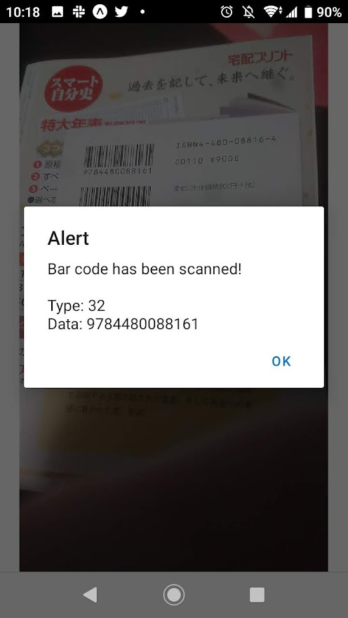

# MEMO
- local working directory
  ```console
  PS C:\Users\lbfde> cd .\BookBark\
  PS C:\Users\lbfde\BookBark> code .
  ```

- make project
  - `npx create-expo-app BookBark`

- dependencies
  ```console
  npx expo install expo-barcode-scanner
  npx expo install expo-permissions
  ```

- start
  - `npx expo start`

# Image


